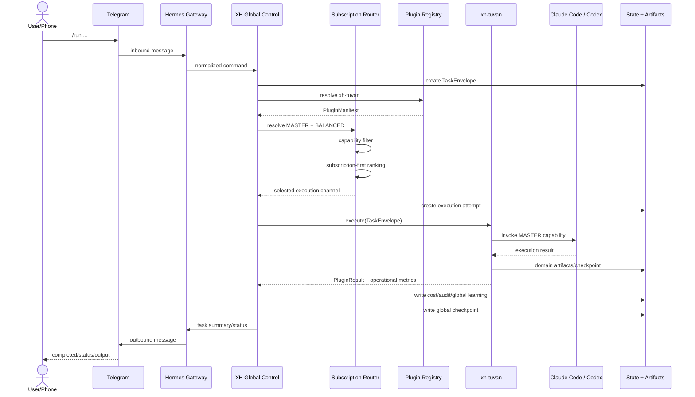
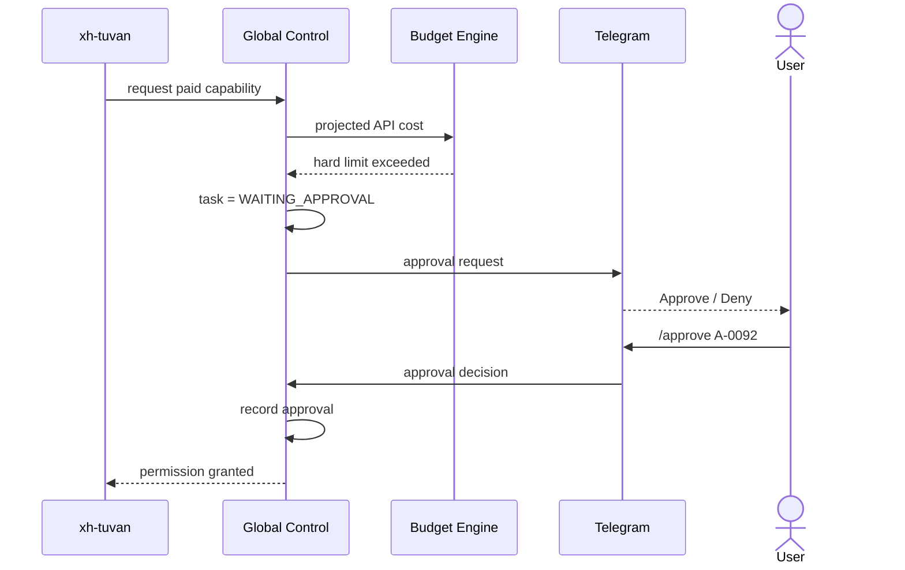

# XH GLOBAL AI CONTROL PLANE
## MVP v0.1 — Implementation Specification

**Version:** 0.1  
**Date:** 2026-09-07  
**Status:** Implementation Baseline  
**Scope:** Global infrastructure/control plane only  
**Explicitly out of scope:** Any construction-consulting business logic owned by `xh-tuvan`

---

# 1. MVP objective

MVP v0.1 must prove one end-to-end path:

```text
Phone
  ↓ Telegram
Hermes / Gateway
  ↓
XH Global Control
  ↓
Plugin Registry
  ↓
xh-tuvan
  ↓
Master execution channel
  ├─ Claude Code subscription
  └─ Codex subscription
  ↓
Artifacts / checkpoint
  ↓
Global status + cost + audit
  ↓
Telegram
```

The MVP is successful when the user can:

1. Submit a task remotely.
2. Select `AUTO`, `CLAUDE`, or `CHATGPT/CODEX` as logical Master.
3. Select `ECONOMY`, `BALANCED`, or `MAX_QUALITY`.
4. Run `xh-tuvan` without Global knowing its internal workflow.
5. Prefer subscription execution channels before paid API.
6. See worker, channel, task status, cost, and latest checkpoint.
7. Pause/resume/cancel.
8. Approve an API budget escalation.
9. Resume from artifacts rather than full conversation history.
10. Produce an auditable task record.

---

# 2. Architecture boundary

## 2.1 Global Control owns

- Task intake
- Plugin selection
- Master capability resolution
- Execution-channel selection
- Subscription state
- Cost/budget policy
- Worker selection
- Permission policy
- Session/task/execution-attempt state
- Artifact/checkpoint management
- Operational logging
- Global model-performance learning
- Telegram/control API
- Future worker failover

## 2.2 `xh-tuvan` owns

- Report workflow
- Chapter/section decomposition
- Technical analysis
- Legal workflow
- Extraction strategy
- Specialist delegation
- Drafting
- QA/QC
- Domain learning
- Domain rules
- Domain prompts
- Domain knowledge

## 2.3 Hard anti-overlap rule

A Global module is invalid if it needs to know things such as:

```text
NCKT chapter structure
ĐXCTĐT outline
technical standards
legal basis
construction cost rules
report-writing style
which model writes which chapter
```

Global only receives opaque task metadata and operational metrics.

---

# 3. Repository structure

```text
xh-ai/
│
├── global-control/
│   ├── pyproject.toml
│   ├── README.md
│   ├── .env.example
│   │
│   ├── src/
│   │   └── xh_control/
│   │       ├── __init__.py
│   │       │
│   │       ├── app.py
│   │       ├── cli.py
│   │       │
│   │       ├── constants.py
│   │       │
│   │       ├── exceptions.py
│   │       │
│   │       ├── logging.py
│   │       │
│   │       │
│   │       ├── core/
│   │       │   ├── controller.py
│   │       │   ├── task_service.py
│   │       │   ├── execution_service.py
│   │       │   ├── approval_service.py
│   │       │   └── event_service.py
│   │       │
│   │       ├── models/
│   │       │   ├── enums.py
│   │       │   ├── task.py
│   │       │   ├── plugin.py
│   │       │   ├── execution.py
│   │       │   ├── worker.py
│   │       │   ├── budget.py
│   │       │   ├── approval.py
│   │       │   ├── artifact.py
│   │       │   └── learning.py
│   │       │
│   │       ├── routing/
│   │       │   ├── master_selector.py
│   │       │   ├── channel_router.py
│   │       │   ├── capability_matcher.py
│   │       │   ├── cost_policy.py
│   │       │   └── scoring.py
│   │       │
│   │       ├── channels/
│   │       │   ├── base.py
│   │       │   ├── claude_code.py
│   │       │   ├── codex.py
│   │       │   ├── openai_api.py
│   │       │   └── anthropic_api.py
│   │       │
│   │       ├── plugins/
│   │       │   ├── base.py
│   │       │   ├── registry.py
│   │       │   └── xh_tuvan_adapter.py
│   │       │
│   │       ├── workers/
│   │       │   ├── registry.py
│   │       │   ├── selector.py
│   │       │   └── heartbeat.py
│   │       │
│   │       ├── state/
│   │       │   ├── db.py
│   │       │   ├── repositories.py
│   │       │   ├── checkpoints.py
│   │       │   └── migrations/
│   │       │
│   │       ├── permissions/
│   │       │   └── policy.py
│   │       │
│   │       ├── interfaces/
│   │       │   ├── hermes_adapter.py
│   │       │   ├── telegram.py
│   │       │   └── control_api.py
│   │       │
│   │       └── learning/
│   │           └── operational_metrics.py
│   │
│   ├── config/
│   │   ├── system.yaml
│   │   ├── routing.yaml
│   │   ├── channels.yaml
│   │   ├── subscriptions.yaml
│   │   ├── budgets.yaml
│   │   ├── plugins.yaml
│   │   ├── workers.yaml
│   │   └── permissions.yaml
│   │
│   ├── schemas/
│   │   ├── task-envelope.schema.json
│   │   ├── plugin-result.schema.json
│   │   ├── plugin-manifest.schema.json
│   │   └── handoff.schema.json
│   │
│   └── tests/
│       ├── unit/
│       ├── integration/
│       └── fixtures/
│
├── plugins/
│   └── xh-tuvan/
│
└── infra/
    ├── hermes/
    └── scripts/
```

---

# 4. Core enums

```python
# models/enums.py

from enum import StrEnum


class CostMode(StrEnum):
    ECONOMY = "ECONOMY"
    BALANCED = "BALANCED"
    MAX_QUALITY = "MAX_QUALITY"


class TaskStatus(StrEnum):
    CREATED = "CREATED"
    QUEUED = "QUEUED"
    ASSIGNED = "ASSIGNED"
    RUNNING = "RUNNING"
    WAITING_APPROVAL = "WAITING_APPROVAL"
    PAUSED = "PAUSED"
    RETRYING = "RETRYING"
    FAILOVER_PENDING = "FAILOVER_PENDING"
    COMPLETED = "COMPLETED"
    FAILED = "FAILED"
    CANCELLED = "CANCELLED"


class ChannelClass(StrEnum):
    SUBSCRIPTION = "subscription"
    FREE_LOCAL = "free_local"
    CHEAP_API = "cheap_api"
    PREMIUM_API = "premium_api"


class ChannelHealth(StrEnum):
    AVAILABLE = "AVAILABLE"
    DEGRADED = "DEGRADED"
    LIMIT_WARNING = "LIMIT_WARNING"
    RATE_LIMITED = "RATE_LIMITED"
    UNAVAILABLE = "UNAVAILABLE"
    UNKNOWN = "UNKNOWN"


class PermissionLevel(StrEnum):
    READ_ONLY = "READ_ONLY"
    SAFE_EDIT = "SAFE_EDIT"
    PROJECT_WRITE = "PROJECT_WRITE"
    SYSTEM_WRITE = "SYSTEM_WRITE"
    PRIVILEGED = "PRIVILEGED"


class MasterPreference(StrEnum):
    AUTO = "AUTO"
    CLAUDE = "CLAUDE"
    CHATGPT = "CHATGPT"


class FailureType(StrEnum):
    WORKER_FAILURE = "WORKER_FAILURE"
    CHANNEL_FAILURE = "CHANNEL_FAILURE"
    RATE_LIMIT = "RATE_LIMIT"
    AUTH_FAILURE = "AUTH_FAILURE"
    PLUGIN_FAILURE = "PLUGIN_FAILURE"
    TOOL_FAILURE = "TOOL_FAILURE"
    BUDGET_BLOCK = "BUDGET_BLOCK"
    PERMISSION_BLOCK = "PERMISSION_BLOCK"
    DATA_SYNC_FAILURE = "DATA_SYNC_FAILURE"
    USER_CANCEL = "USER_CANCEL"
```

---

# 5. TaskEnvelope v1

```python
# models/task.py

from datetime import datetime
from pydantic import BaseModel, Field
from .enums import CostMode, PermissionLevel, MasterPreference, TaskStatus


class ProjectRef(BaseModel):
    project_id: str
    workspace_uri: str


class TaskBudget(BaseModel):
    api_soft_usd: float = Field(ge=0)
    api_hard_usd: float = Field(ge=0)


class ExecutionRequest(BaseModel):
    master_capability: str = "MASTER"
    master_preference: MasterPreference = MasterPreference.AUTO
    cost_mode: CostMode = CostMode.BALANCED


class PermissionRequest(BaseModel):
    level: PermissionLevel = PermissionLevel.SAFE_EDIT


class TaskEnvelope(BaseModel):
    schema_version: str = "1.0"
    task_id: str
    created_at: datetime
    task_type: str
    plugin: str
    report_type: str | None = None
    project: ProjectRef
    execution: ExecutionRequest
    permissions: PermissionRequest
    budget: TaskBudget
    user_request: str


class TaskRecord(BaseModel):
    task: TaskEnvelope
    status: TaskStatus
    assigned_worker: str | None = None
    resolved_channel: str | None = None
    current_attempt_id: str | None = None
    latest_checkpoint_uri: str | None = None
```

Important:

`user_request` may contain the high-level task request, but Global must not parse report-domain structure from it. It is passed to the owning plugin.

---

# 6. ExecutionChannel model

```python
# models/execution.py

from pydantic import BaseModel, Field
from .enums import ChannelClass, ChannelHealth


class ExecutionChannel(BaseModel):
    channel_id: str

    provider: str
    surface: str
    model: str | None = None

    channel_class: ChannelClass
    billing_mode: str

    capabilities: set[str]

    enabled: bool = True
    priority: int = 100

    health: ChannelHealth = ChannelHealth.UNKNOWN

    estimated_input_usd_per_mtoken: float | None = None
    estimated_output_usd_per_mtoken: float | None = None

    supports_files: bool = False
    supports_terminal: bool = False
    supports_structured_output: bool = False

    metadata: dict = Field(default_factory=dict)
```

The routing unit is `ExecutionChannel`, not merely provider or model.

Examples:

```text
claude-code-subscription
codex-subscription
deepseek-api
openai-api-premium
local-qwen
```

---

# 7. Plugin contract

## 7.1 PluginManifest

```python
# models/plugin.py

from pydantic import BaseModel, Field


class PluginManifest(BaseModel):
    plugin_id: str
    version: str
    interface_version: str

    domain: str

    entrypoint_type: str
    entrypoint: str

    accepted_task_types: set[str]

    owns_domain_workflow: bool = True
    owns_domain_learning: bool = True

    required_global_capabilities: set[str] = Field(default_factory=set)

    allowed_global_learning_fields: set[str] = Field(
        default_factory=lambda: {
            "model_performance",
            "cost",
            "latency",
            "routing",
            "provider_reliability",
            "token_efficiency",
        }
    )
```

## 7.2 PluginResult

```python
from pydantic import BaseModel, Field


class OutputArtifact(BaseModel):
    artifact_type: str
    uri: str
    sha256: str | None = None


class ExecutionSummary(BaseModel):
    elapsed_seconds: float
    api_spend_usd: float = 0
    subscription_calls: int = 0
    api_calls: int = 0
    retries: int = 0


class GlobalLearningSummary(BaseModel):
    model_performance: list[dict] = Field(default_factory=list)
    routing: list[dict] = Field(default_factory=list)
    provider_reliability: list[dict] = Field(default_factory=list)
    token_efficiency: list[dict] = Field(default_factory=list)


class PluginResult(BaseModel):
    schema_version: str = "1.0"
    task_id: str
    status: str

    outputs: list[OutputArtifact] = Field(default_factory=list)

    execution_summary: ExecutionSummary
    global_learning: GlobalLearningSummary

    domain_learning_stored_by_plugin: bool = True
    domain_learning_candidate_count: int = 0

    handoff_uri: str | None = None
```

Global must reject any `global_learning` payload containing domain-specific keys such as legal rules, technical rules, report structure, or writing rules.

---

# 8. Plugin interface

```python
# plugins/base.py

from abc import ABC, abstractmethod
from xh_control.models.task import TaskEnvelope
from xh_control.models.plugin import PluginResult


class DomainPluginAdapter(ABC):

    @abstractmethod
    async def healthcheck(self) -> bool:
        ...

    @abstractmethod
    async def execute(self, task: TaskEnvelope) -> PluginResult:
        ...

    @abstractmethod
    async def pause(self, task_id: str) -> None:
        ...

    @abstractmethod
    async def resume(self, task_id: str) -> PluginResult:
        ...

    @abstractmethod
    async def cancel(self, task_id: str) -> None:
        ...
```

`XHTuvanAdapter` must act only as an interface adapter. It must not reimplement any `xh-tuvan` business workflow.

---

# 9. Execution-channel interface

```python
# channels/base.py

from abc import ABC, abstractmethod
from dataclasses import dataclass


@dataclass
class ChannelRequest:
    task_id: str
    capability: str
    prompt_or_instruction: str
    workspace: str
    artifact_refs: list[str]


@dataclass
class ChannelResponse:
    success: bool
    output_ref: str | None
    usage: dict
    latency_seconds: float
    error_type: str | None = None


class ExecutionChannelAdapter(ABC):

    @abstractmethod
    async def healthcheck(self) -> dict:
        ...

    @abstractmethod
    async def execute(self, request: ChannelRequest) -> ChannelResponse:
        ...

    @abstractmethod
    async def cancel(self, task_id: str) -> None:
        ...
```

MVP adapters:

```text
ClaudeCodeAdapter
CodexAdapter
```

API adapters may exist as stubs until Phase 2.

---

# 10. Infrastructure abstraction

Hermes must be replaceable.

```python
# interfaces/hermes_adapter.py

from abc import ABC, abstractmethod


class InfrastructureAdapter(ABC):

    @abstractmethod
    async def send_message(self, destination: str, message: str) -> None:
        ...

    @abstractmethod
    async def run_process(
        self,
        command: list[str],
        cwd: str,
        env: dict[str, str] | None = None,
    ) -> int:
        ...

    @abstractmethod
    async def terminate_process(self, process_id: str) -> None:
        ...

    @abstractmethod
    async def register_callback(self, event_type: str, callback) -> None:
        ...
```

Global business policy must not import Hermes internal classes directly outside this adapter layer.

---

# 11. Config files

## 11.1 system.yaml

```yaml
system:
  name: XH-AI
  environment: production

  default_cost_mode: BALANCED
  default_master: AUTO

  subscription_first: true

  state_backend: sqlite
  sqlite_path: runtime/control.db

  infrastructure:
    adapter: hermes

  artifact_root: runtime/artifacts
```

## 11.2 channels.yaml

```yaml
channels:

  claude-code-subscription:
    provider: anthropic
    surface: claude_code
    channel_class: subscription
    billing_mode: subscription

    priority: 100
    enabled: true

    capabilities:
      - MASTER
      - REASONING
      - CODING
      - FILES
      - TERMINAL

    supports_files: true
    supports_terminal: true
    supports_structured_output: true

  codex-subscription:
    provider: openai
    surface: codex
    channel_class: subscription
    billing_mode: subscription

    priority: 100
    enabled: true

    capabilities:
      - MASTER
      - REASONING
      - CODING
      - FILES
      - TERMINAL

    supports_files: true
    supports_terminal: true
    supports_structured_output: true
```

## 11.3 subscriptions.yaml

```yaml
subscriptions:

  claude:
    enabled: true
    preferred_channel: claude-code-subscription

    health_policy:
      rate_limit_cooldown_minutes: 30

  chatgpt:
    enabled: true
    preferred_channel: codex-subscription

    health_policy:
      rate_limit_cooldown_minutes: 30
```

## 11.4 routing.yaml

```yaml
routing:

  class_priority:
    subscription: 100
    free_local: 80
    cheap_api: 50
    premium_api: 20

  weights:
    capability_fit: 1.00
    subscription_bonus: 0.90
    quality: 0.70
    reliability: 0.60
    worker_affinity: 0.40

    monetary_cost: -0.80
    token_cost: -0.50
    latency: -0.20
    handoff_penalty: -0.40

  modes:

    ECONOMY:
      premium_api_allowed: false
      cross_review_allowed: false
      api_escalation_threshold: high

    BALANCED:
      premium_api_allowed: true
      cross_review_allowed: false
      api_escalation_threshold: medium

    MAX_QUALITY:
      premium_api_allowed: true
      cross_review_allowed: true
      api_escalation_threshold: low

  fallback:
    max_retries_same_channel: 1
    allow_cross_provider: true
```

## 11.5 budgets.yaml

```yaml
budgets:

  global:
    monthly_api_hard_usd: 30.0

  daily:
    api_soft_usd: 3.0
    api_hard_usd: 8.0

  defaults:
    task_api_soft_usd: 1.0
    task_api_hard_usd: 3.0

  plugins:
    xh-tuvan:
      task_api_soft_usd: 2.0
      task_api_hard_usd: 5.0
```

## 11.6 plugins.yaml

```yaml
plugins:

  xh-tuvan:
    plugin_id: xh-tuvan
    version: "1.x"
    interface_version: "1.0"
    domain: construction_consulting

    entrypoint_type: process
    entrypoint: "python -m xh_tuvan"

    accepted_task_types:
      - generate_report
      - review_report
      - analyze_project

    owns_domain_workflow: true
    owns_domain_learning: true

    required_global_capabilities:
      - filesystem

    allowed_global_learning_fields:
      - model_performance
      - cost
      - latency
      - routing
      - provider_reliability
      - token_efficiency
```

## 11.7 workers.yaml

MVP:

```yaml
workers:

  pc-main:
    hostname: XH-PC
    enabled: true
    priority: 100

    capabilities:
      - windows
      - python
      - claude_code
      - codex
      - office

    paths:
      git_root: "D:/XH-AI"
      project_root: "G:/My Drive/Projects"
```

## 11.8 permissions.yaml

```yaml
permissions:

  default_level: SAFE_EDIT

  levels:

    READ_ONLY:
      read_project: true
      write_temp: false
      write_project: false
      modify_system: false

    SAFE_EDIT:
      read_project: true
      write_temp: true
      write_project: false
      modify_system: false

    PROJECT_WRITE:
      read_project: true
      write_temp: true
      write_project: true
      modify_system: false

    SYSTEM_WRITE:
      read_project: true
      write_temp: true
      write_project: true
      modify_system: true
      approval_required: true

    PRIVILEGED:
      approval_required: always
```

---

# 12. SQLite schema

## 12.1 tasks

```sql
CREATE TABLE tasks (
    task_id TEXT PRIMARY KEY,
    schema_version TEXT NOT NULL,
    plugin_id TEXT NOT NULL,
    task_type TEXT NOT NULL,
    report_type TEXT,
    project_id TEXT NOT NULL,
    workspace_uri TEXT NOT NULL,
    user_request TEXT NOT NULL,

    cost_mode TEXT NOT NULL,
    master_preference TEXT NOT NULL,
    permission_level TEXT NOT NULL,

    api_soft_usd REAL NOT NULL,
    api_hard_usd REAL NOT NULL,

    status TEXT NOT NULL,

    assigned_worker_id TEXT,
    resolved_channel_id TEXT,
    current_attempt_id TEXT,
    latest_checkpoint_uri TEXT,

    created_at TEXT NOT NULL,
    updated_at TEXT NOT NULL
);
```

## 12.2 execution_attempts

```sql
CREATE TABLE execution_attempts (
    attempt_id TEXT PRIMARY KEY,
    task_id TEXT NOT NULL,
    attempt_no INTEGER NOT NULL,

    worker_id TEXT NOT NULL,
    channel_id TEXT,

    status TEXT NOT NULL,
    failure_type TEXT,
    failure_message TEXT,

    started_at TEXT,
    ended_at TEXT,

    generation INTEGER NOT NULL DEFAULT 1,

    FOREIGN KEY(task_id) REFERENCES tasks(task_id)
);
```

## 12.3 task_events

```sql
CREATE TABLE task_events (
    event_id INTEGER PRIMARY KEY AUTOINCREMENT,
    task_id TEXT NOT NULL,
    attempt_id TEXT,

    event_type TEXT NOT NULL,
    payload_json TEXT NOT NULL,

    created_at TEXT NOT NULL
);
```

Append-only. Do not update historical rows.

## 12.4 cost_events

```sql
CREATE TABLE cost_events (
    cost_event_id INTEGER PRIMARY KEY AUTOINCREMENT,
    task_id TEXT NOT NULL,
    attempt_id TEXT,

    channel_id TEXT NOT NULL,
    billing_mode TEXT NOT NULL,

    input_tokens INTEGER,
    output_tokens INTEGER,

    estimated_usd REAL NOT NULL DEFAULT 0,

    created_at TEXT NOT NULL
);
```

For subscription channels `estimated_usd` may be `0`, while usage metadata can still be recorded.

## 12.5 approvals

```sql
CREATE TABLE approvals (
    approval_id TEXT PRIMARY KEY,
    task_id TEXT NOT NULL,

    action TEXT NOT NULL,
    reason TEXT NOT NULL,

    payload_json TEXT NOT NULL,

    status TEXT NOT NULL,
    requested_at TEXT NOT NULL,
    decided_at TEXT,
    decided_by TEXT
);
```

## 12.6 artifacts

```sql
CREATE TABLE artifacts (
    artifact_id TEXT PRIMARY KEY,
    task_id TEXT NOT NULL,
    attempt_id TEXT,

    artifact_type TEXT NOT NULL,
    uri TEXT NOT NULL,
    sha256 TEXT,

    size_bytes INTEGER,
    created_at TEXT NOT NULL
);
```

## 12.7 channel_health

```sql
CREATE TABLE channel_health (
    channel_id TEXT PRIMARY KEY,
    health TEXT NOT NULL,

    consecutive_failures INTEGER NOT NULL DEFAULT 0,
    last_success_at TEXT,
    last_failure_at TEXT,
    cooldown_until TEXT,

    metadata_json TEXT NOT NULL
);
```

## 12.8 global_learning_events

```sql
CREATE TABLE global_learning_events (
    learning_event_id TEXT PRIMARY KEY,

    task_id TEXT,
    plugin_id TEXT,
    channel_id TEXT,
    capability TEXT,

    success INTEGER NOT NULL,
    latency_seconds REAL,
    estimated_cost_usd REAL,
    estimated_context_tokens INTEGER,
    retries INTEGER,

    quality_score REAL,

    created_at TEXT NOT NULL
);
```

No domain knowledge columns are permitted.

---

# 13. Checkpoint and artifact layout

Each project may contain:

```text
<project>/.ai/
│
├── GLOBAL_TASK.json
├── STATE.json
├── HANDOFF.json
├── ARTIFACT_INDEX.json
└── checkpoints/
    ├── CP-0001.json
    ├── CP-0002.json
    └── ...
```

The domain plugin may maintain additional files of its own. Global does not interpret them unless explicitly part of the interface contract.

## Global checkpoint example

```json
{
  "schema_version": "1.0",
  "task_id": "T-20260907-001",
  "attempt_id": "A-001",
  "generation": 1,

  "plugin": "xh-tuvan",
  "plugin_state_ref": ".ai/xh-tuvan/HANDOFF.json",

  "global_status": "RUNNING",

  "worker_id": "pc-main",
  "channel_id": "claude-code-subscription",

  "artifact_refs": [
    ".ai/ARTIFACT_INDEX.json"
  ],

  "next_global_action": "resume_plugin",

  "created_at": "2026-09-07T22:00:00+07:00"
}
```

Global treats `plugin_state_ref` as opaque.

---

# 14. Subscription-first routing

## 14.1 Candidate filtering

```python
def build_candidates(task, channels):
    return [
        ch for ch in channels
        if ch.enabled
        and task.execution.master_capability in ch.capabilities
        and ch.health not in {"UNAVAILABLE", "RATE_LIMITED"}
    ]
```

## 14.2 Priority order

Hard default:

```text
subscription
→ free/local
→ cheap API
→ premium API
```

But capability mismatch always disqualifies a channel.

## 14.3 Master preference

```text
AUTO
  → normal subscription-first ranking

CLAUDE
  → boost Claude subscription channel
  → fallback only if unavailable / incapable

CHATGPT
  → boost Codex subscription channel
  → fallback only if unavailable / incapable
```

Preference is not a permanent hard lock unless user explicitly requests strict routing.

## 14.4 Scoring

```python
score = (
    1.00 * capability_fit
    + 0.90 * subscription_bonus
    + 0.70 * quality_score
    + 0.60 * reliability_score
    + 0.40 * worker_affinity
    - 0.80 * monetary_cost_score
    - 0.50 * token_cost_score
    - 0.20 * latency_score
    - 0.40 * handoff_penalty
)
```

MVP may use static defaults for `quality_score` and `reliability_score`.

Adaptive learning is explicitly postponed.

---

# 15. Budget logic

```python
async def authorize_api_call(task, expected_cost):
    task_spend = get_task_api_spend(task.task_id)

    projected = task_spend + expected_cost

    if projected <= task.budget.api_soft_usd:
        return "ALLOW"

    if projected <= task.budget.api_hard_usd:
        emit_warning(task.task_id)
        return "ALLOW_WITH_WARNING"

    create_approval(
        task_id=task.task_id,
        action="EXCEED_API_HARD_LIMIT",
        payload={"projected_usd": projected},
    )

    set_task_status(task.task_id, "WAITING_APPROVAL")
    return "BLOCK_PENDING_APPROVAL"
```

Critical rule:

Crossing an API hard limit must not block subscription/local work that can continue without paid API.

---

# 16. Token optimization in MVP

Implement only the high-return mechanisms first.

## 16.1 Artifact-first handoff

Never send full prior conversation by default.

Use:

```text
TASK
STATE
DECISIONS
ARTIFACT_INDEX
HANDOFF
```

## 16.2 Hash-based reuse

Store SHA-256 for artifacts.

If the same immutable artifact is already available to the current worker/channel, do not duplicate it.

## 16.3 Lazy context

Global passes references, not raw file contents, whenever the plugin/channel can access the same workspace.

## 16.4 Script before model

Global must never call an LLM for deterministic infrastructure operations such as:

- JSON parsing
- hashing
- file existence checks
- path mapping
- config validation
- cost arithmetic
- worker health checks

## 16.5 Handoff penalty

Switching channels is not free. The router should penalize unnecessary model switching.

---

# 17. Worker model for MVP

MVP has one worker:

```text
pc-main
```

Worker selection still exists as an abstraction so that the laptop can be added without redesign.

```python
class WorkerSelector:
    def select(self, required_capabilities: set[str]) -> str:
        ...
```

The selector must reject workers missing a required capability.

---

# 18. Future failover hooks included in MVP

Even before laptop auto-failover exists, add these fields now:

```text
attempt_id
attempt_no
generation
assigned_worker_id
latest_checkpoint_uri
```

This prevents schema migration later.

When multi-worker is added:

```text
heartbeat
lease
fencing generation
manual handoff
auto failover
```

can be layered on top.

---

# 19. Telegram commands for MVP

Keep command surface small.

```text
/run
/status
/tasks
/master
/mode
/cost
/pause
/resume
/stop
/approve
/deny
```

Optional:

```text
/plugins
/channels
```

Do not add worker switching until laptop support exists.

---

# 20. Telegram command semantics

## /run

Example:

```text
/run plugin=xh-tuvan project=KE-RACH-RAP task="Lập Báo cáo NCKT"
```

Default values:

```text
master=AUTO
mode=BALANCED
permission=SAFE_EDIT
```

Response:

```text
Task created: T-20260907-001

Plugin: xh-tuvan
Project: KE-RACH-RAP
Worker: pc-main
Master: AUTO
Resolved channel: claude-code-subscription
Mode: BALANCED
API budget: $2 soft / $5 hard
Status: RUNNING
```

## /master

```text
/master auto
/master claude
/master chatgpt
```

Sets default preference for subsequent tasks.

## /mode

```text
/mode economy
/mode balanced
/mode max
```

## /status T-...

Returns:

```text
status
worker
channel
plugin
cost
attempt
latest checkpoint
latest milestone
```

## /pause

Requests safe plugin checkpoint first.

## /stop

Flow:

```text
CANCEL_REQUESTED
→ ask plugin for safe checkpoint
→ stop execution
→ persist handoff
→ CANCELLED
```

## /approve

Approves exactly one pending approval unless an explicit wider scope is selected.

---

# 21. Telegram handler architecture

Bad:

```python
@bot.command("run")
def run_command(...):
    # routing logic
    # budget logic
    # plugin logic
```

Correct:

```python
@bot.command("run")
async def run_command(message):
    request = parse_user_request(message)
    task = await controller.create_and_start_task(request)
    await presenter.send_task_summary(task)
```

Telegram is only a UI adapter.

---

# 22. Control API

Even if the MVP only uses Telegram, expose a thin local API so a future dashboard can reuse the same logic.

Suggested endpoints:

```text
POST   /v1/tasks
GET    /v1/tasks
GET    /v1/tasks/{task_id}

POST   /v1/tasks/{task_id}/pause
POST   /v1/tasks/{task_id}/resume
POST   /v1/tasks/{task_id}/cancel

GET    /v1/channels
GET    /v1/plugins

GET    /v1/costs

POST   /v1/approvals/{approval_id}/approve
POST   /v1/approvals/{approval_id}/deny
```

No domain-specific endpoints.

---

# 23. End-to-end controller flow

```python
class GlobalController:

    async def create_and_start_task(self, request):
        task = self.task_service.create_task(request)

        plugin = self.plugin_registry.resolve(task.plugin)

        self.permission_policy.validate(task)

        worker = self.worker_selector.select(
            plugin.required_global_capabilities
        )

        channel = self.channel_router.resolve_master_channel(
            task=task,
            worker_id=worker,
        )

        attempt = self.execution_service.create_attempt(
            task=task,
            worker_id=worker,
            channel_id=channel.channel_id,
        )

        self.task_service.assign(
            task_id=task.task_id,
            worker_id=worker,
            channel_id=channel.channel_id,
            attempt_id=attempt.attempt_id,
        )

        self.event_service.append(
            task.task_id,
            "TASK_STARTED",
            {
                "plugin": plugin.plugin_id,
                "worker": worker,
                "channel": channel.channel_id,
            },
        )

        result = await plugin.execute(task)

        self.task_service.finalize_from_plugin_result(result)

        return self.task_service.get(task.task_id)
```

In practice execution should be background-process based, but this synchronous-looking orchestration is the correct logical contract for MVP tests.

---

# 24. End-to-end sequence diagram



Important:

`X -> C` may internally involve many domain decisions. Global does not see or manage those decisions.

---

# 25. Approval sequence



---

# 26. Failover-ready state model

MVP does not implement automatic laptop failover yet, but every task must be structured as:

```text
Task
  └─ Execution Attempt 1
       ├─ Worker
       ├─ Channel
       ├─ Generation
       └─ Checkpoint
```

Future:

```text
Task
  ├─ Attempt 1: PC + Claude, generation 1
  ├─ Attempt 2: Laptop + Claude, generation 2
  └─ Attempt 3: Laptop + Codex, generation 3
```

Task identity remains unchanged.

---

# 27. Operational learning

Global stores only:

```text
channel
capability
success/failure
latency
cost
retries
token/context efficiency
provider reliability
user override
```

Example:

```json
{
  "task_id": "T-20260907-001",
  "plugin_id": "xh-tuvan",
  "channel_id": "claude-code-subscription",
  "capability": "MASTER",
  "success": true,
  "latency_seconds": 412,
  "estimated_cost_usd": 0,
  "estimated_context_tokens": 38000,
  "retries": 0,
  "quality_score": 0.91
}
```

Global must never persist fields such as:

```text
engineering_rule
legal_rule
report_rule
writing_rule
chapter_rule
technical_standard
```

Those belong to the plugin.

---

# 28. Security

MVP rules:

1. No API key in Git.
2. No Telegram token in Git.
3. No OAuth/session credentials in logs.
4. `.env` only contains local secret references or secrets excluded by `.gitignore`.
5. Prefer OS credential store when practical.
6. System-write actions require approval.
7. Agent-generated source changes go to a branch, not directly to `main`.
8. Audit all permission elevation.
9. Log artifact hashes, not sensitive artifact contents.

`.gitignore` minimum:

```gitignore
.env
runtime/
*.db
*.sqlite
secrets/
credentials/
__pycache__/
.pytest_cache/
```

---

# 29. Testing strategy

## Unit tests

Mandatory:

```text
test_task_envelope_validation
test_plugin_manifest_validation
test_domain_learning_rejected_from_global
test_subscription_channel_beats_api_when_capable
test_unhealthy_subscription_is_skipped
test_hard_budget_requires_approval
test_permission_escalation_requires_approval
test_task_state_transitions
test_artifact_hashing
```

## Integration tests

Mandatory:

```text
Telegram/CLI request
→ TaskEnvelope
→ plugin resolution
→ subscription routing
→ mock xh-tuvan
→ mock Claude/Codex adapter
→ PluginResult
→ SQLite events
→ final status
```

## Boundary test

Critical architectural test:

```text
Replace xh-tuvan mock with generic-plugin mock.
```

Global must still work without knowing the domain.

If not, Global contains domain leakage.

---

# 30. MVP implementation milestones

## M0 — Repository bootstrap

Deliver:

```text
repo
pyproject
config loader
Pydantic models
SQLite migration
CLI skeleton
```

Exit criterion:

```text
xhctl validate-config
```

passes.

## M1 — Task core

Deliver:

```text
TaskService
state machine
event log
artifact registry
```

Exit criterion:

```text
xhctl run --dry-run ...
```

creates a task and audit trail.

## M2 — Plugin contract

Deliver:

```text
PluginRegistry
DomainPluginAdapter
XHTuvanAdapter stub
PluginResult validation
```

Exit criterion:

A mock `xh-tuvan` task completes without Global knowing any report workflow.

## M3 — Subscription router

Deliver:

```text
ClaudeCodeAdapter healthcheck
CodexAdapter healthcheck
ChannelRouter
MasterSelector
CostMode
BudgetEngine
```

Exit criterion:

When both subscription channels are healthy, no paid API is selected.

## M4 — Real xh-tuvan integration

Deliver:

```text
TaskEnvelope → xh-tuvan
PluginResult ← xh-tuvan
artifact references
operational metrics
```

Exit criterion:

One real domain task runs end to end.

## M5 — Telegram

Deliver:

```text
/run
/status
/tasks
/master
/mode
/cost
/pause
/resume
/stop
/approve
/deny
```

Exit criterion:

The entire M4 workflow can be controlled from phone.

## M6 — Artifact-first resume

Deliver:

```text
global checkpoint
plugin handoff reference
resume flow
context reuse
```

Exit criterion:

Stop/restart Global Control and resume an interrupted task without replaying full chat history.

This marks **MVP v0.1 complete**.

---

# 31. Explicitly postponed to v0.2+

Do not implement before MVP completion:

```text
automatic PC↔laptop failover
VPS coordinator
web dashboard
PostgreSQL
Redis
Celery
Kafka
distributed locks
adaptive ML router
complex local-model farm
multi-user RBAC
automatic skill refactoring
cross-domain shared learning
```

Manual laptop handoff is the first post-MVP extension.

---

# 32. Recommended build order for Codex/Claude Code

Give the coding agent tasks in this order:

```text
1. Build package skeleton.
2. Implement enums and Pydantic models.
3. Implement config loader + validation.
4. Implement SQLite migrations/repositories.
5. Implement task state machine.
6. Implement event/audit service.
7. Implement plugin registry + mock plugin.
8. Implement channel model + mock channels.
9. Implement subscription-first router.
10. Implement budget/approval engine.
11. Implement CLI.
12. Run boundary/integration tests.
13. Implement Claude Code adapter.
14. Implement Codex adapter.
15. Implement real XHTuvanAdapter.
16. Implement artifact/checkpoint layer.
17. Implement Telegram adapter.
18. Run end-to-end acceptance test.
```

Do not let the coding agent add architecture beyond this list without an explicit change request.

---

# 33. Coding-agent guardrails

The implementation prompt must include these rules:

```text
DO NOT:
- put xh-tuvan business logic into Global Control;
- hardcode report chapters;
- hardcode Claude as permanent Master;
- hardcode ChatGPT as permanent Master;
- treat subscription and API as the same billing channel;
- use Google Drive as runtime database;
- store credentials in Git;
- make Telegram handlers contain routing/business logic;
- modify Hermes internals unless absolutely unavoidable;
- build dashboard before MVP completion;
- add distributed infrastructure without demonstrated need.
```

Architecture change rule:

```text
If a requested implementation appears to require violating this specification,
stop that change, document the conflict, and create an Architecture Change Request.
```

---

# 34. Acceptance test

Final MVP acceptance scenario:

```text
Given:
- PC online
- Hermes gateway online
- Telegram connected
- Claude subscription healthy
- Codex subscription healthy
- xh-tuvan registered
- project available on Google Drive
- default mode BALANCED

When:
User sends:
  /run plugin=xh-tuvan project=PROJECT-X task="..."

Then:
1. Global creates TaskEnvelope.
2. Global validates permissions and budget.
3. Global assigns pc-main.
4. Global resolves MASTER through subscription-first routing.
5. No API is used if subscription capability is sufficient.
6. Global calls XHTuvanAdapter.
7. xh-tuvan owns internal workflow.
8. xh-tuvan returns output/status/operational learning.
9. Global stores audit/cost/checkpoint.
10. Telegram returns completion/status.
11. Global stores no domain knowledge.
12. Task can be resumed from artifacts after controller restart.
```

If all 12 pass, MVP v0.1 is accepted.

---

# 35. Architecture decision record

**ADR-001 — Infrastructure**  
Hermes is infrastructure/gateway/runtime, not the XH policy engine.

**ADR-002 — Global Control**  
Custom XH Global Control is a thin policy/control plane.

**ADR-003 — Domain orchestration**  
`xh-tuvan` owns all construction-consulting workflow and domain learning.

**ADR-004 — Routing unit**  
Route by `ExecutionChannel`, not only provider/model.

**ADR-005 — Cost policy**  
`subscription > free/local > cheap API > premium API`.

**ADR-006 — State**  
SQLite owns runtime state. Git and Google Drive own durable code/artifacts, not locks or live task state.

**ADR-007 — Context transfer**  
Artifact/checkpoint-first; full chat history is not the default handoff mechanism.

**ADR-008 — Learning separation**  
Global stores operational learning only. Domain learning remains inside the owning plugin.

**ADR-009 — Failover**  
Future failover is checkpoint + lease + fencing based, not RAM/session migration.

**ADR-010 — UI**  
Telegram first. Dashboard later, using the same Control API.

---

# 36. Next implementation artifact

The next file to generate should be:

```text
IMPLEMENTATION_PROMPT_MVP_v0.1.md
```

It should be a strict coding prompt for Codex/Claude Code containing:

- repository target;
- exact file tree;
- models/interfaces above;
- milestones M0–M6;
- acceptance tests;
- architecture guardrails;
- requirement to stop and raise an Architecture Change Request instead of silently redesigning the system.
